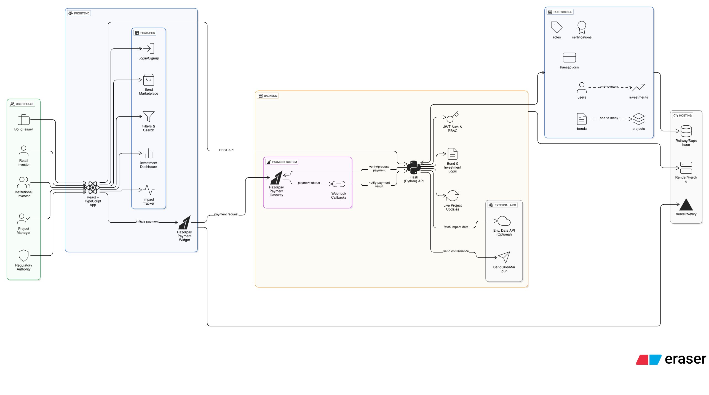

# 🌱 GreenBonds Finance Platform

> The world’s first all-in-one platform combining financial insights and crowdfunding for green projects, offering seamless green bond investments with real-time environmental impact tracking.

[](https://www.typescriptlang.org/)
[](https://reactjs.org/)
[](https://tailwindcss.com/)
[](https://vitejs.dev/)
[](https://www.python.org/)
[](https://flask.palletsprojects.com/)
[](https://razorpay.com/)


## 🚀 Overview

GreenBonds is a revolutionary financial platform that bridges the private capital gap in sustainable development by combining green bond issuance with transparent, interactive web technology. Fund eco-friendly projects while monitoring real-time environmental impact metrics.

### ✨ Key Features

- 🏦 *Multi-User Authentication* - Support for retail investors, institutional investors, bond issuers, project managers, and regulators
- 📊 *Advanced Bond Marketplace* - Filter, search, and sort green bonds by category, risk rating, and investment amount
- 💰 *Investment Management* - Complete portfolio tracking with performance metrics and returns calculation
- 🌍 *Real-Time Impact Tracking* - Monitor CO₂ reduction, energy generated, water saved, and hectares restored
- 📈 *Interactive Dashboards* - Role-based views tailored for different user types
- 📱 *Responsive Design* - Optimized for desktop, tablet, and mobile devices
- 🎨 *Modern UI/UX* - Built with Shadcn-ui and Tailwind CSS for a premium experience


### Quick Start

## 🌟 Platform Features

### 🏠 Landing Page
- Compelling hero section with value proposition
- Feature highlights and impact statistics  
- User type explanations and onboarding flow
- Responsive design with modern animations

### 🔐 Authentication System
- Multi-role user registration and login
- Password validation and error handling

### 🏪 Bond Marketplace
- *4 Sample Green Bonds* across different categories:
  - 🌞 Solar Energy Development ($50M)
  - 🚗 Electric Vehicle Infrastructure ($75M) 
  - 💧 Water Conservation Technology ($30M)
  - 🌳 Biodiversity Conservation ($100M)
- Advanced filtering by bond type, project category, risk rating
- Grid and list view options
- Real-time funding progress tracking

### 📋 Bond Details
- Comprehensive bond information and documentation
- Project details with milestone tracking
- Investment interface with validation
- Impact metrics visualization
- Risk assessment and certification display

# Users & Dashboards

This platform supports multiple user types, each with specific features and dashboards.

| User Type             | Features                                      |
|-----------------------|-----------------------------------------------|
| Retail Investor       | Portfolio tracking, investment management    |
| Bond Issuer           | Bond management, fundraising progress        |
| Institutional Investor| Advanced analytics, bulk investments         |
| Project Manager       | Project oversight, milestone tracking        |
| Regulatory            | Compliance monitoring, reporting             |

---

## Dashboards

### Investor Dashboard
- Portfolio overview with performance metrics
- Investment allocation charts (doughnut/pie)
- Environmental impact summary
- Recent activity and notifications
- Investment management tools and recommendations

### Issuer Dashboard  
- Bond management and funding progress
- Project oversight and milestone tracking
- Fundraising analytics and investor relations
- Reporting for investor engagement and bond performance

### Institutional Investor Dashboard
- Advanced analytics for investment decisions
- Bulk investment management
- Portfolio performance summaries
- Environmental and social impact metrics
- Notifications and alerts for investment opportunities

### Project Manager Dashboard
- Project progress and budget utilization
- Milestone completion tracking
- Impact metrics reporting
- Resource allocation monitoring
- Integration with funding and investor dashboards

### Regulatory Dashboard
- Compliance monitoring and reporting
- Risk assessment and alerts
- Audit trails for transactions and projects
- Dashboard summaries for ongoing oversight


### 📈 Impact Tracking
- *Real-time Environmental Metrics*:
  - CO₂ Emissions Reduced (tons/year)
  - Clean Energy Generated (MWh/year) 
  - Water Saved (liters/year)
  - Forest Area Restored (hectares)
- Interactive charts with Chart.js
- Third-party verification status
- SDG alignment indicators



## Folder Structure (Overview)


```
greenbond/
├── .gitignore
└── EcoQuad/
    ├── README.md
    ├── green_bonds_platform/
    │   ├── prd.md
    │   └── system_design.md
    ├── payment-backend/
    │   ├── app.py
    │   ├── auth.py
    │   ├── models.py
    │   ├── requirements.txt
    │   └── tests/
    │       ├── test_auth.py
    │       ├── test_registration.py
    │       └── test_complete_auth.py
    └── shadcn-ui/
        ├── package.json
        ├── index.html
        ├── src/
        │   ├── App.tsx
        │   ├── components/
        │   │   ├── Charts.tsx
        │   │   ├── ProtectedRoute.tsx
        │   │   └── ui/...
        │   ├── contexts/
        │   │   └── AuthContext.tsx
        │   ├── lib/
        │   │   ├── api.ts
        │   │   └── razorpayClient.ts
        │   ├── pages/
        │   │   ├── Dashboard.tsx
        │   │   ├── BondMarketplace.tsx
        │   │   ├── BondDetails.tsx
        │   │   └── Auth.tsx
        │   └── types/
        │       └── index.ts
        ├── tailwind.config.ts
        └── vite.config.ts
```


## 🌍 Environmental Impact

This platform demonstrates real environmental impact through funded projects:

- *130,000+ tons CO₂* reduced annually
- *420+ MWh* clean energy generated  
- *50M+ liters* water saved through conservation
- *Multiple SDGs* supported (7, 11, 13, 15)


*Built with ❤ for a sustainable future* 🌱


